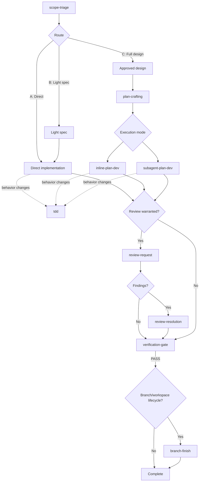
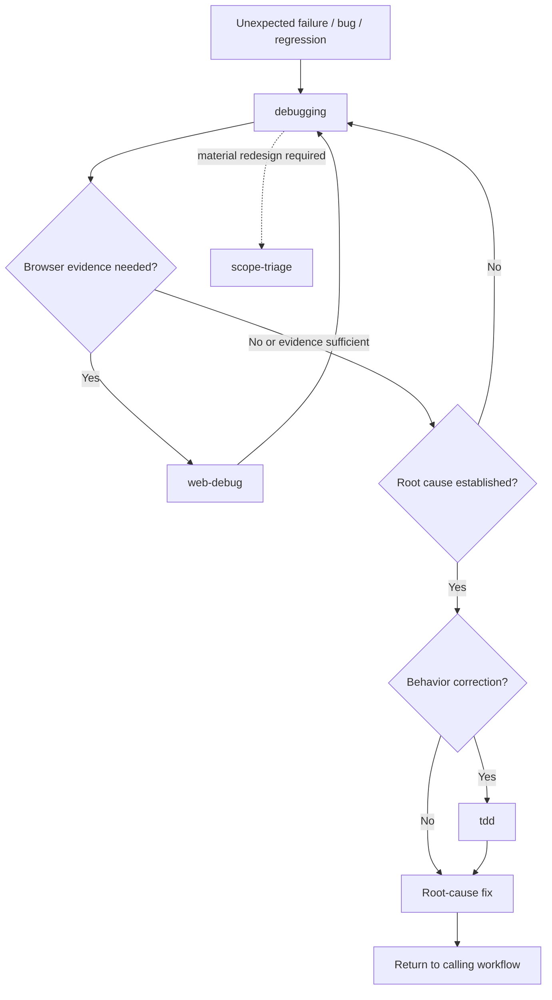

# Agent Skills

[](https://skills.sh/sentimony/skills)

A collection of agent skills for Claude Code, Codex and other AI coding agents.

## Install

```bash
# All at once

npx skills add sentimony/skills -a codex claude-code -y

# Or each separately

npx skills add sentimony/skills -s scope-triage -a codex claude-code -y
npx skills add sentimony/skills -s plan-crafting -a codex claude-code -y
npx skills add sentimony/skills -s inline-plan-dev -a codex claude-code -y
npx skills add sentimony/skills -s subagent-plan-dev -a codex claude-code -y
npx skills add sentimony/skills -s tdd -a codex claude-code -y
npx skills add sentimony/skills -s debugging -a codex claude-code -y
npx skills add sentimony/skills -s web-debug -a codex claude-code -y
npx skills add sentimony/skills -s review-request -a codex claude-code -y
npx skills add sentimony/skills -s review-resolution -a codex claude-code -y
npx skills add sentimony/skills -s verification-gate -a codex claude-code -y
npx skills add sentimony/skills -s branch-finish -a codex claude-code -y
npx skills add sentimony/skills -s workspace-isolation -a codex claude-code -y
npx skills add sentimony/skills -s parallel-agents -a codex claude-code -y
npx skills add sentimony/skills -s frontend-crafting -a codex claude-code -y
npx skills add sentimony/skills -s echarts -a codex claude-code -y
npx skills add sentimony/skills -s typescript -a codex claude-code -y
npx skills add sentimony/skills -s vitest -a codex claude-code -y
npx skills add sentimony/skills -s maintaining-agent-context -a codex claude-code -y
npx skills add sentimony/skills -s commit-all -a codex claude-code -y
npx skills add sentimony/skills -s dashfix -a codex claude-code -y
npx skills add sentimony/skills -s negafix -a codex claude-code -y
```

## Development Workflow

`scope-triage` is the development entry point. It classifies the request and picks the
minimum appropriate process, so a one-line configuration change and a new subsystem do not
receive the same ceremony.



When work fails unexpectedly, the diagnostic path runs alongside the main flow and returns
to whatever workflow discovered the failure.



Four properties of this workflow are worth stating explicitly.

- **`tdd` is used within implementation, whenever behavior changes.** It is a micro-cycle
  inside a task rather than a sequential phase that follows implementation. Both execution
  modes and direct implementation invoke it at the moment a behavior change is written.
- **Review is proportional; verification is authoritative.** `review-request` is invoked
  when the change warrants independent eyes, and `review-resolution` validates findings
  before anything is changed in response. A review verdict stands separate from completion:
  `verification-gate` owns the authoritative pass or fail against the current tree.
- **The diagnostic path has three distinct owners.** `debugging` owns causal investigation,
  `web-debug` supplies browser and runtime evidence when the symptom lives in a page, and
  `tdd` drives the regression behavior once the cause is known. The fix then returns to the
  workflow that discovered the failure.
- **The workflow is composable rather than mandatory-linear.** Every step after `scope-triage` is
  reached on a condition. Route A terminates in implementation with proportional
  verification, and `branch-finish` runs only when a branch or workspace lifecycle exists.

Conditional capabilities, invoked when the work calls for them rather than in sequence:
`tdd`, `debugging`, `web-debug`, `workspace-isolation`, `parallel-agents`,
`frontend-crafting`, `vitest`, `typescript`, `echarts`.

## Skills

### Design & Planning

| Skill | Skill Version | Release | Description |
| --- | --- | --- | --- |
| [scope-triage](skills/scope-triage/SKILL.md) | 1.0.4 | v1.34.0 | Classify request scope before design work, then route to direct implementation, a light spec, or a full design cycle. |
| [plan-crafting](skills/plan-crafting/SKILL.md) | 1.3.0 | v1.32.0 | Turn an approved design or settled requirements into a bite-sized, TDD-oriented implementation plan. |

### Execution

| Skill | Skill Version | Release | Description |
| --- | --- | --- | --- |
| [inline-plan-dev](skills/inline-plan-dev/SKILL.md) | 1.0.0 | v1.32.0 | Execute an existing implementation plan inline in the current session, with plan-reality reconciliation, proportional verification, and durable resume. |
| [subagent-plan-dev](skills/subagent-plan-dev/SKILL.md) | 1.0.0 | v1.32.0 | Execute an existing implementation plan through scoped subagents with risk-based dispatch, independent verification, and controlled escalation. |
| [tdd](skills/tdd/SKILL.md) | 1.0.2 | v1.33.1 | Drive behavior changes through valid RED, sufficient GREEN, and evidence-backed refactoring. |

### Debugging

| Skill | Skill Version | Release | Description |
| --- | --- | --- | --- |
| [debugging](skills/debugging/SKILL.md) | 1.0.6 | v1.33.1 | Investigate bugs and unexpected technical behavior with a root-cause-first evidence workflow. |
| [web-debug](skills/web-debug/SKILL.md) | 1.3.3 | v1.26.0 | Debug and verify local web apps via Playwright. |

### Review & Verification

| Skill | Skill Version | Release | Description |
| --- | --- | --- | --- |
| [review-request](skills/review-request/SKILL.md) | 1.0.0 | v1.27.0 | Prepare and dispatch independent code review against requirements, exact scope, and the actual diff. |
| [review-resolution](skills/review-resolution/SKILL.md) | 1.0.0 | v1.28.0 | Validate and resolve code-review findings with evidence, explicit dispositions, and proportional re-review decisions. |
| [verification-gate](skills/verification-gate/SKILL.md) | 1.0.0 | v1.29.0 | Turn a completion claim into an evidence-backed verdict against the current tree. |

### Completion & Workspace

| Skill | Skill Version | Release | Description |
| --- | --- | --- | --- |
| [branch-finish](skills/branch-finish/SKILL.md) | 1.0.0 | v1.33.0 | Decide, execute and report the integration outcome for verified work, cleaning up only what is provably safe to remove. |
| [workspace-isolation](skills/workspace-isolation/SKILL.md) | 1.0.0 | v1.30.0 | Select, detect, or create a safe isolated development workspace with explicit ownership, baseline, and handoff. |
| [parallel-agents](skills/parallel-agents/SKILL.md) | 1.0.0 | v1.31.0 | Prove work units independent, isolate mutable state, and dispatch one bounded parallel wave with reconciled results. |

### Frontend

| Skill | Skill Version | Release | Description |
| --- | --- | --- | --- |
| [frontend-crafting](skills/frontend-crafting/SKILL.md) | 1.3.0 | v1.23.0 | Create, redesign, review, and polish user interfaces with subject-driven design decisions and a verifiable quality gate. |
| [echarts](skills/echarts/SKILL.md) | 1.2.0 | v1.22.0 | Build, audit, style, debug, and optimize Apache ECharts visualizations in vanilla JS, React, or Vue. |

### TypeScript & Testing

| Skill | Skill Version | Release | Description |
| --- | --- | --- | --- |
| [typescript](skills/typescript/SKILL.md) | 1.4.0 | v1.20.0 | Configure tsconfig, diagnose compiler behavior, and audit or migrate TypeScript projects. |
| [vitest](skills/vitest/SKILL.md) | 1.3.0 | v1.21.0 | Configure, write, debug, run, migrate, and audit Vitest tests for JavaScript/TypeScript projects. |

### Agent Context

| Skill | Skill Version | Release | Description |
| --- | --- | --- | --- |
| [maintaining-agent-context](skills/maintaining-agent-context/SKILL.md) | 1.3.0 | v1.24.0 | Audit, restructure, and maintain a repository's agent instruction architecture for Claude Code and Codex. |

### Git Workflow

| Skill | Skill Version | Release | Description |
| --- | --- | --- | --- |
| [commit-all](skills/commit-all/SKILL.md) | 1.1.0 | v1.16.0 | Gather the working tree into a single commit on the current branch, on explicit /commit-all invocation only. |

### Writing Style

| Skill | Skill Version | Release | Description |
| --- | --- | --- | --- |
| [dashfix](skills/dashfix/SKILL.md) | 1.2.1 | v1.12.1 | Ban typographic dashes in English text, check their form where a language's orthography requires them, audit a project, and score it 0-100. |
| [negafix](skills/negafix/SKILL.md) | 1.2.1 | v1.12.1 | Ban negative parallelism ("it's not just X, it's Y"), audit prose for it, and score it 0-100. |

Have fun ;)
